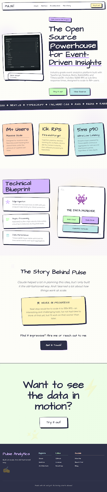

<div align="center">

# Pulse Analytics

### Self-hosted, privacy-friendly web analytics — SDK, ingestion pipeline, and dashboard.

Track pageviews and custom events on any site with a tiny SDK, ingest them through a high-throughput API built for 10k RPS, and explore them in a clean dashboard. No cookies, no third parties, your data stays on your infra.

[](https://www.npmjs.com/package/@akdevv/pulse)




</div>

---

## How it works

```
┌──────────┐   POST /track    ┌─────────────┐   enqueue   ┌─────────┐
│  Site +  │ ───────────────▶ │  Ingestion  │ ──────────▶ │  Redis  │
│   SDK    │                  │  API (hot   │             │ (BullMQ)│
└──────────┘                  │  path, <5ms)│             └────┬────┘
                              └─────────────┘                  │
                                                               ▼
┌──────────┐   REST/queries   ┌─────────────┐   writes   ┌───────────┐
│Dashboard │ ◀──────────────▶ │  Analytics  │ ◀───────── │  Worker   │
│(Next.js) │                  │     API     │            │(enrich +  │
└──────────┘                  └──────┬──────┘            │ batch)    │
                                     │                   └─────┬─────┘
                                     ▼                         ▼
                              ┌─────────────────────────────────────┐
                              │        TimescaleDB (Postgres)       │
                              └─────────────────────────────────────┘
```

The hot path is deliberately thin: the ingestion endpoint validates, rate-limits, and enqueues — everything heavy (user-agent parsing, GeoIP lookup, batched DB writes) happens async in the worker. Full design notes in [`docs/ingestion-api-architecture.md`](./docs/ingestion-api-architecture.md).

## What's in the repo

| Directory | What it is |
|---|---|
| [`sdk/`](./sdk) | [`@akdevv/pulse`](https://www.npmjs.com/package/@akdevv/pulse) — lightweight JS/TS SDK with a React hook. Published on npm. |
| [`backend/`](./backend) | Express 5 API + BullMQ worker pipeline. Auth (JWT + refresh tokens), site management, event ingestion, analytics queries. |
| [`frontend/`](./frontend) | Next.js dashboard — auth, site management, and analytics charts (Recharts + shadcn/ui). |
| [`docs/`](./docs) | Architecture and build guides written alongside development. |

## Features

- **SDK**: pageview + custom event tracking, no cookies, SPA route-change aware, React hook (`usePulse`)
- **Ingestion**: Redis-backed rate limiting, Zod validation, async enrichment (device via ua-parser, geo via MaxMind), batched TimescaleDB writes
- **Analytics API**: pageviews, visitors, top pages, referrers, devices, and geo breakdowns over time ranges
- **Dashboard**: multi-site support, per-site analytics views, dark mode
- **Testing**: Vitest unit/integration suite + Artillery load-test scripts (`backend/tests/load/`)

## Tech stack

**Backend** — Node.js, Express 5, TypeScript, Prisma 7, TimescaleDB, Redis + BullMQ, Zod, Docker
**Frontend** — Next.js, React Query, Tailwind, shadcn/ui, Recharts
**SDK** — zero-dependency TypeScript, tsup build, dual vanilla/React entry points

## Getting started

Requires Node ≥ 22, pnpm, and Docker.

```bash
# Backend (starts TimescaleDB + Redis via docker compose, then API + worker)
cd backend
cp .env.example .env
pnpm install
pnpm db:migrate
pnpm dev

# Frontend
cd frontend
cp .env.example .env
pnpm install
pnpm dev
```

Drop the SDK into any site:

```ts
import { Pulse } from "@akdevv/pulse/sdk";

Pulse.init({
  siteId: "your-site-id",
  apiHost: "http://localhost:8000",
});
```

## Status & roadmap

Core pipeline (SDK → ingestion → worker → TimescaleDB → dashboard) works end-to-end locally. Backend is deployed on Railway. Remaining plan (see [`docs/plan.md`](./docs/plan.md)):

- [ ] Public demo site wired to the live backend
- [ ] 10k RPS sustained load test (Artillery scripts ready in `backend/tests/load/`)
- [ ] Load-test case study write-up
- [ ] AI-powered queries — natural language → validated SQL over your analytics data

## License

MIT
